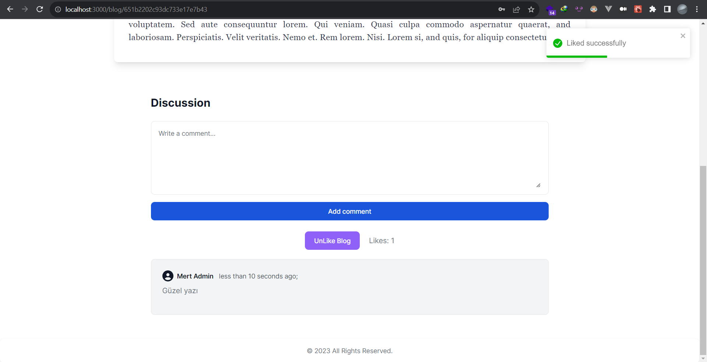
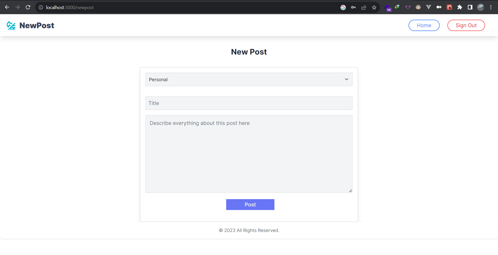
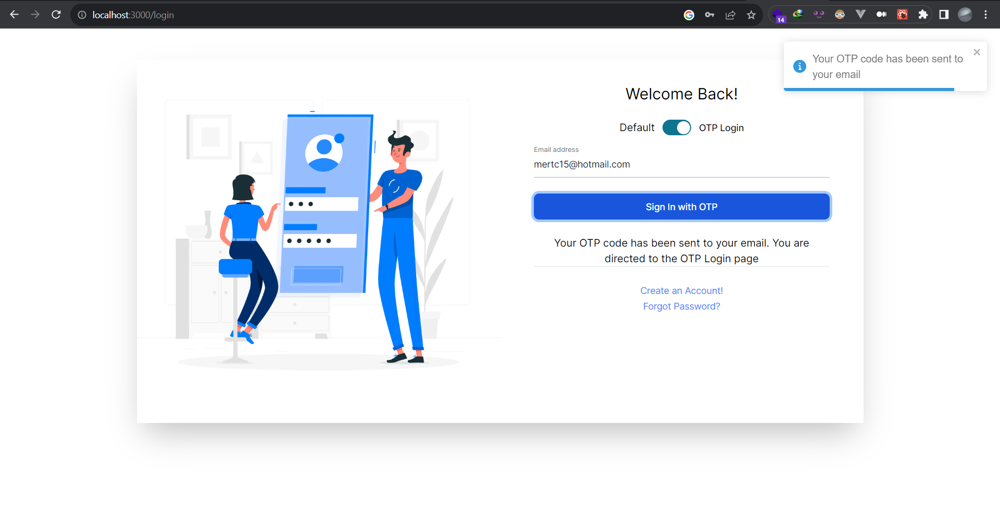
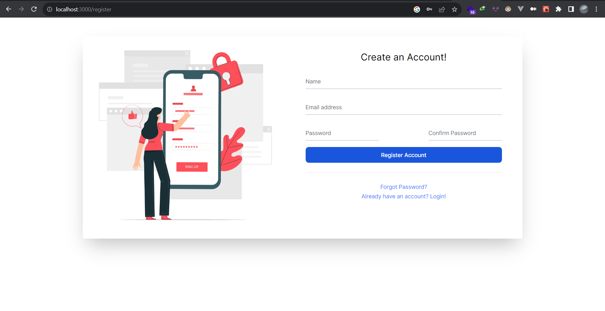
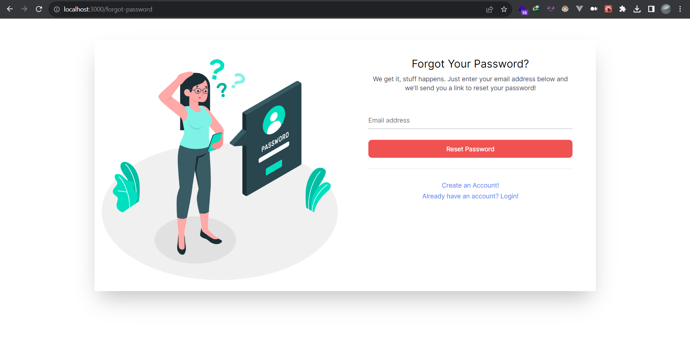
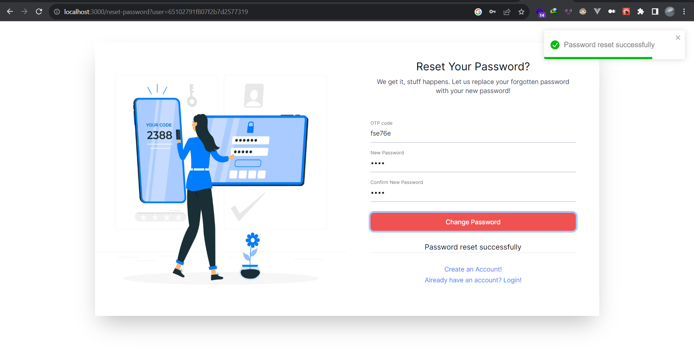

import Image from 'next/image';

# Mert Çalışkan - Bitirme Ödevi - Blog Projesi

Next JS 13 App Router + TypeScript + MongoDB + Redux + Tailwind

 

 

 

 

### Sonradan eklenen kütüphaneler

| bcrypt | chart-js | Flowbite React | date-fns | react-toastify |

## Projede

- Varsayılan olarak register olan kullanıcılar Role = 0 olarak kaydedilir.

- Admin yetkisi için veritabanında Role = 1 yapılmalıdır.

- OTP ile giriş, mail doğrulama ve parola sıfırlama için ayrı OTP kodu mail ile gönderilir.

- Kullanıcı girişinde app/getUser ile alınıp JWT Token headera yazılmaktadır.

- Token ayrıca Reduxta tutulur. Backend api isteklerinde sayfa değişikliğinde redux kontrol edilir. Redux bilgisinin doğruluğuna göre işlemler yapılır.

### Protected Pages:

- /dashboard ve alt dizinler : Sadece admin yetkisi olanlar
- /newpost : Sadace login olanlar

### Giriş sayfalarında:

- Şifre ile ve OTP ile giriş yapma seçeneği bulunur.

- Başarılı girişte kullancının Role değerine göre "/dashboard" veya "/" sayfasına yönlendirilir.

- Register olduktan sonra verify sayfasına yönlendirilir ve OTP giriş kodu mail yoluyla gönderilir.

- Veritabanından gelen JWT Token Remember Me seçiliyken Local Storage kaydedilir. Varsayılan olarak Session Storage kaydedilir.

- Sayfa yenileme durumudna eğer Redux boş olursa localstorage veya session storageda token kontrol edilip backendde istek gönderilir. Backendde gelen yanıta göre oturum bilgisi Reduxta tutulmaya devam eder.

- Forgot Password kısmında mail adresi doğruysa Reset Password sayfasına yönlendirilir. Kullanıcı mailine gelmiş olan OTP koduyla yeni parolasını girerek değiştriebilir.

### Home Sayfasında:

- Kullanıcı giriş yaptığında kendi bloglarını, beğendiği blogları ve tüm blogları görmektedir.

- Giriş yapılmadığında sadece tüm blogları görmektedir.

- Bloglarda learn more linkine tıklayarak istenilen bloga gidebilir, ancak kullanıcı kendi blogunu beğenemez.

- Kullanıcı like atıp veya geri çekip, yorum yapabilir. Giriş yapılmadan bu bölümler gizlenir

- New Post kısmında admin tarafından oluşturulmuş kategorilerden biri seçildikten sonra diğer bilgiler girilir ve oluşturulmuş blog sayfasına yönlendirilir

### Admin Sayfasında:

- Role = 1(Admin) olan kullanıcılar giriş yapabilmektedir.

- Dashboard kısmında otomatik doğrulama, bakım modu, ve Kayıt olmayı açma kapatma ayarları ve genel istatistikler bulunmaktadır.

- Kullanıcılar kısmında Role = 0 (Not Admin) olan kullanıcılar tabloda gözükmektedir.

- Category kısmında katagori ekleme ve silme işlemi yapılır.

- Blog kısmında blog başlığı, içerikten 1 satır, yazar ismi ve silme işlemi yapılmaktadır.

- Delete işlemi yapıldığında veritabanında isDelete: true değerine dönüşür ve listede gözükmez.